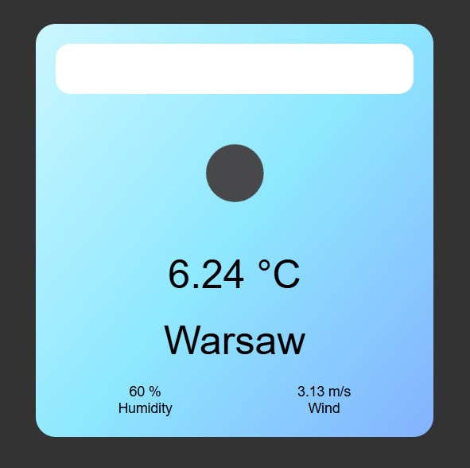

# Weather App 🌦️

This Weather App allows users to view current weather conditions for any city they type into the search input. On page load, the app also displays weather data for a randomly selected city. The application uses the OpenWeatherMap API to fetch data such as temperature, wind speed, humidity, and weather conditions.



---

## Features ✨

- **Random City Weather on Page Load:** Displays weather data for a randomly selected city when the app is first loaded.
- **City Search:** Users can enter any city name to view the current weather conditions.
- **Weather Details:** Displays temperature, humidity, wind speed, and weather icon.
- **Responsive Design:** The layout is optimized for various screen sizes.

---

## Technologies Used 🛠️

- **JavaScript (ES6 Modules)** for modular coding and functionality
- **HTML & CSS** for structuring and styling the app
- **OpenWeatherMap API** for fetching live weather data

---

## Installation and Setup 🚀

To run this project locally, follow these steps:

1. **Clone the Repository:**

   ```bash
   git clone https://github.com/yourusername/weather-app.git
   cd weather-app

2. **Get Your API Key:**

- Sign up for a free API key at OpenWeatherMap.
- Add Your API Key:
  - Open the api_connection.js file in your project.
  - Locate the line with the variable apiKey and add your API key as shown below:

   ```javascript
   let apiKey = 'YOUR_API_KEY_HERE'; // Add your API key here
